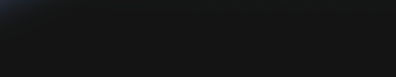
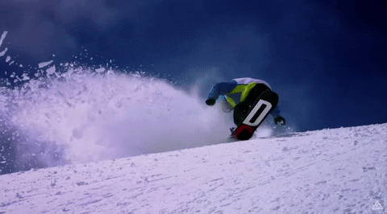

# 👋 Hi there 👋

----

## 👨‍💻 Who Am I 👨‍💻

### - 🇮🇹 An italian student, worker and athlete born in 2000
### - 📚 I’m currently studying Engineering and Computer Science - UniBo

----

## 🔧 My Skills 🔧
  
  <b> 💻 Operating Systems 💻 </b>   
  

  
  
  
  
  
  

  
  <b> 📝 Programming Languages 📝 </b>  
  

    
    
    
    
    
    
    
  

  
  <b> 💡 Other Stuff 💡 </b>  
  

    
    
    
  

  

----

## 📲 My social accounts 📲

   
    
  

----

## 🔥 My Hobbies 🔥
### - 🏐 Volleyball Player in Serie B - 🟡Sab Heli Rubicone Team🔵

 
### - 🏂 Addicted to Snowboarding

